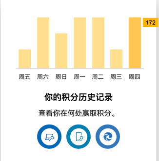
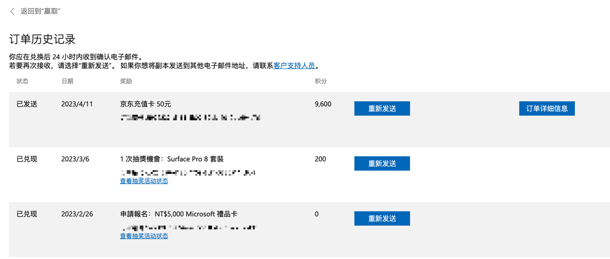

***我杜绝实名上网***
# CakeAL的个人介绍

## 简介
2021级物联网工程本科`（机械类→物联网工程）`  
大一的时光在疫情中浪费掉了。  
大二想学很多东西。

目前掌握的技能：macOS/Linux大多数使用方法，Photoshop，Adobe Illustrator，Adobe Premiere Pro.  
  
正在学习：后端，前端，WeChat小程序。

## 兴趣
* 音乐：东方曲，音游曲。
* 番剧：https://space.bilibili.com/13161874/bangumi
* 电影：科幻类，喜剧类，动漫类。
* 游戏：Minecraft，Touhou Project（STG），Musedash（Level：>3300）(on Steam and Tablet)，Phigros(rks：>15.03)，Arcaea（ptt：>12.18）。
* 体育：游泳（蛙泳完全掌握），羽毛球（比入门强点等级），骑车（最远一次骑了60km in 4hours，打算上半年继续骑，每次40km打底，买了喜德盛390，并且换了细胎）。
* 其他项目：
  * 绘画：只会照葫芦画瓢一些简单的东西（比如github和qq的头像）。
  * 摄影：持有一加⑨Pro，使用谷歌相机，拍一些自以为好看的烂片。

## 目前正在干什么有意思的事情
筹集微软Rewards积分（使用油猴脚本自动bing搜索），到9600积分可以换一个50块钱的京东券😭。  
每天固定大概170积分，大概需要57天就能让微软v我50元京东券。(目前已经兑换券数量：1)

每周四下午（游泳课），周五早上去游泳。  
每周末去逛北京市属各个公园。  
时不时跨市流动（天津等地进行一个大学生特种兵旅游）。  
骑车（并且炫耀自己的轨迹）。  

## 我的其他平台社交账号
`Bilibili 6级年度大会员` https://space.bilibili.com/13161874/  
`我的世界中文论坛 Lv.11` https://www.mcbbs.net/?1037910  
`酷安 Lv.3` http://www.coolapk.com/u/3528316
`Twitter` https://twitter.com/Cake_AL_2  
`Steam Lv.10` Cake_AL  
`IT之家 Lv.37` 某蛋糕 ID：1863692  